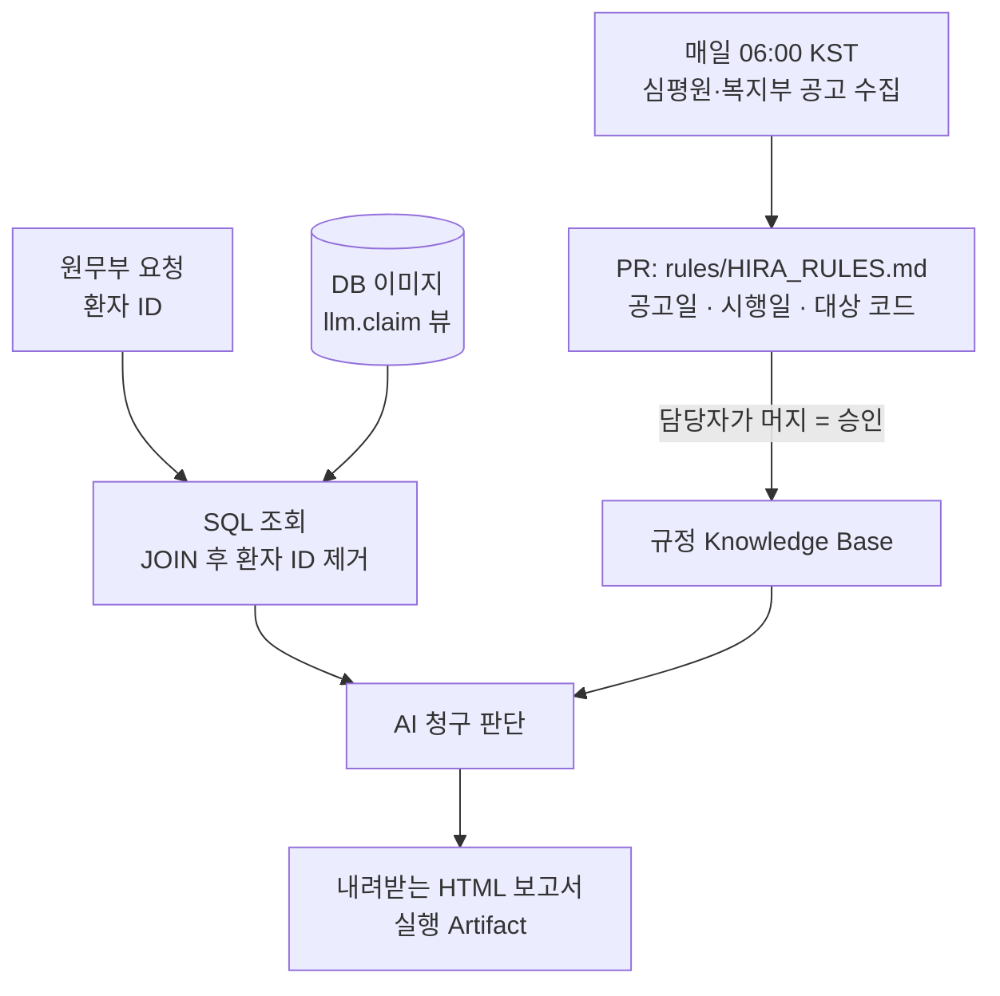

# HIRA Billing Copilot

매일 바뀌는 심평원 규정과 환자 한 명의 진료내역을 **자동으로 이어 주는** 템플릿입니다.
규정은 아침마다 모여 PR로 올라오고, 원무 담당자가 머지하면 그 규정으로 청구를 판단합니다.

AI는 데이터베이스에 접속하지 않습니다. 환자 식별은 SQL 조회 단계에서만 쓰고, AI에게는
비식별 진료행과 규정 문서만 갑니다. 판단 결과는 저장소에 남지 않고 내려받는 보고서로만
나옵니다.

## 파이프라인



| 단계 | 워크플로 | 트리거 | 산출물 |
|---|---|---|---|
| 0. 규정 동기화 | `hira-rule-sync.md` | 매일 크론 · 수동 | `rules/HIRA_RULES.md` PR |
| 0. DB 이미지 | `publish-db-image.yml` | `db/**` 변경 · 수동 | 본인 GHCR 이미지 |
| 1~2. 요청과 조회 | `billing-intake.yml` | 화면 · Actions 폼 | 비식별 진료행 JSON |
| 3~4. 판단과 보고서 | `billing-review.md` | 2단계가 호출 | Artifact `billing-report` |
| — | `build-dashboard.yml` | 이미지 게시 후 · 수동 | `site/index.html` · Pages |
| — | `sweep-runs.yml` | 30분마다 | 지난 요청 실행 만료 |

규정 동기화는 PR을 만들 뿐 스스로 머지하지 않습니다. 머지가 곧 담당자의 승인입니다.

### 0. 규정 동기화

새벽마다 심평원·복지부 공고를 훑어 **청구에 닿는 변경만** 골라 `rules/HIRA_RULES.md`에
추가하는 PR을 엽니다. 기존 항목은 지우지 않습니다 — 2025-12-30 진료분은 그때의 규정으로
판단해야 하기 때문입니다.

공고를 받아오는 일은 방화벽 밖 `steps:`에서 파이썬이 하고, 무엇이 우리 청구에 닿는지
고르는 판단만 AI가 합니다. 접속이 실패하면 조용히 넘어가지 않고 알립니다.

### 1. 요청

화면 가운데 검색창에 환자 ID를 넣고 Enter를 칩니다. 진료일과 모델도 그 자리에서 고릅니다.
요청은 저장소에 남지 않습니다.

### 2. 조회

환자 ID는 `billing-intake` 안에서 앱 자격증명으로 한 번 쓰이고 **거기서 끝납니다.**
조인은 `llm.claim` 뷰가 이미 해 두었고, 그 결과에서 `patient_id` 한 열만 빼서
JSON으로 넘깁니다. 열을 손으로 나열하지 않아 뷰에 열이 늘어도 빠뜨려 새지 않습니다.

```sql
SELECT jsonb_agg(to_jsonb(c) - 'patient_id' ORDER BY c.treatment_date)
FROM llm.claim c WHERE c.patient_id = 'P00013'
```

### 3. 판단

진료건마다 규정과 대조해 **급여 인정 / 조건부 / 불인정**을 가릅니다. 이때 먼저 보는 것이
**진료일과 시행일**입니다. 규정은 공고 다음 날부터 자동으로 적용되지 않습니다 —
2026-07-31 신설된 코드를 그 전 진료분에 청구했다면 그때는 없던 코드입니다.

금액은 본인부담률과 맞는지 산술로 검산하되 **고쳐 쓰지 않고 어긋났다고 보고합니다.**

### 4. 결과

판단 결과는 이슈·PR·커밋 어디에도 게시되지 않습니다. `safe-outputs`를 `staged`로 두어
출력 창구로만 쓰고, 같은 실행 안에서 `render_report.py`가 HTML로 구워
**실행 Artifact `billing-report`** 로만 내려받습니다. 요청을 보낸 화면은 실행이 끝나기를
기다렸다가 받는 버튼을 띄웁니다.

## 데이터 보호

`llm.claim` 뷰가 "AI에게 나갈 수 있는 열"의 정의입니다. 아래는 **뷰에 열 자체가 없습니다.**

```
patient_name  birth_date  mobile_phone  resident_id_token  treatment_id  encounter_id
```

`patient_id`는 조회 키라서 뷰에 남기되, `llm_reader`에게는 **그 열만 빼고** 권한을 줍니다
(열 단위 `GRANT`). 그래서 `SELECT *`는 권한 오류가 나고, 대시보드를 굽는 쪽도 환자 ID를
읽지 못합니다. 나이는 진료일 기준으로 계산되어 들어가고 생년월일은 나가지 않습니다.

```
billing=> SELECT patient_id FROM claim LIMIT 1;
ERROR:  permission denied for column patient_id of relation claim

billing=> SELECT patient_name FROM public.patient_master;
ERROR:  permission denied for schema public

billing=> CREATE TABLE probe(x int);
ERROR:  cannot execute CREATE TABLE in a read-only transaction
```

이 경계는 `db/init.sql` 끝의 게이트가 **이미지 빌드 중에** 확인합니다. 경계가 열린 이미지는
만들어지지 않고, `db/test-access.sh`가 배포 전에 한 번 더 봅니다.

### 무엇이 어디에 얼마나 남나

| 어디 | 남는 것 | 수명 |
|---|---|---|
| 저장소 (git · 이슈 · PR) | 없음 | — |
| 실행 로그 | 없음 | — |
| `billing-intake` 실행 입력값 | 환자 ID | 30분 |
| `billing-review` 실행 입력값 | 비식별 진료행 | 7일 |
| Artifact `billing-report` | 판단 보고서 | 7일 |

입력값이 남는 것은 페이지가 정적이어서가 아닙니다. `workflow_dispatch`를 부르는 쪽이
무엇이든 깃헙은 "실행할 때 무엇을 넣었나"를 그 실행에 붙여 둡니다. 그래서 없애는 대신
`sweep-runs`가 30분마다 지난 요청 실행을 지웁니다.

## 시작하기

실습으로 처음 돌려보신다면 [instructions.md](instructions.md)를 따라가세요.

이 저장소를 템플릿으로 새 저장소를 만들면 **DB 이미지와 대시보드가 저절로 만들어집니다.**
템플릿 복사의 첫 커밋이 push 이벤트를 일으키기 때문입니다. 남는 설정은 두 가지입니다.

1. Settings → Actions → General → **Allow GitHub Actions to create and approve pull requests**
   (규정 동기화 PR에 필요합니다)
2. Settings → Pages → Source를 **GitHub Actions** 로 지정 (화면을 웹으로 열 때만)

Pages는 워크플로가 대신 켤 수 없습니다 — 저장소 설정을 바꾸는 일이라 관리 권한이 필요하고
실행 토큰에는 그것이 없습니다. 켜지 않아도 `site/index.html`을 내려받아 더블클릭하면
같은 화면이 열립니다.

DB 이미지는 `ghcr.io/<본인 아이디>/<저장소 이름>-db` 로 올라갑니다. 이름에 저장소까지 넣는
이유는 GHCR 패키지가 처음 만든 저장소에 묶이기 때문입니다 — 계정 이름만 쓰면 같은 사람이
두 번째 저장소를 만들 때 `denied: permission_denied: write_package` 로 막힙니다.
GHCR은 소문자만 받으니 저장소 이름도 소문자로 지으세요.

### 진료비 확인 요청하기

두 가지 길이 있습니다. 깃헙이 익명 요청으로는 워크플로를 시작해 주지 않기 때문입니다.

| | 설정 | 하는 일 | 결과 |
|---|---|---|---|
| **화면** | 토큰 1회 | 환자 ID + Enter | 화면에 진행 표시 후 받기 |
| **Actions 폼** | 없음 | Run workflow에 입력 | 실행의 Artifacts에서 받기 |

화면에서 ID를 넣으면 연결 설정이 저절로 뜹니다. 이미 만들어 둔 토큰이 있으면 붙여넣고,
없으면 **토큰 만들기**를 누르면 권한(`repo`)이 미리 체크된 발급 화면이 열립니다.
토큰은 **그 브라우저에만** 저장되고 페이지에도 저장소에도 들어가지 않습니다.

판단에 쓸 모델은 `auto`(기본) · `sonnet` · `opus` · `haiku` · `gpt-5` · `gemini-pro`
중에서 고릅니다. `auto` 외의 값은 요금제에 따라 거절될 수 있습니다.

### 로컬에서 DB 실행

```bash
export GHCR_REPO=YOUR_GITHUB_ID/YOUR_REPO
gh auth token | docker login ghcr.io -u "${GHCR_REPO%%/*}" --password-stdin
docker compose up -d
./db/test-access.sh          # 경계가 서 있는지 확인
```

### 로컬에서 도구 점검

```bash
python3 tools/build_dashboard.py --check   # 판정 로직 자체 점검
python3 tools/render_report.py --check     # 보고서 변환기 자체 점검
```

## 구성

```text
.
├── .github/workflows/
│   ├── shared/billing-db.md          # DB 서비스 · 비식별 뷰 조회 도구 (공용)
│   ├── hira-rule-sync.md             # 0단계: 매일 아침 규정 동기화
│   ├── billing-intake.yml            # 1~2단계: 조회 후 식별정보 제거 → 호출
│   ├── billing-review.md             # 3~4단계: 받은 진료행으로 판단 → 보고서
│   ├── build-dashboard.yml           # 화면 빌드 후 Pages 배포
│   ├── publish-db-image.yml          # DB 이미지 → 본인 GHCR
│   └── sweep-runs.yml                # 지난 요청 실행 만료 (30분 / 7일)
├── db/                               # PostgreSQL 이미지, llm.claim 뷰, 합성 데이터
├── rules/HIRA_RULES.md               # 규정 Knowledge Base (시행일 추적)
├── tools/
│   ├── fetch_notices.py              # 심평원·복지부 공고 수집
│   ├── build_dashboard.py            # llm.claim + 규정 → site/index.html
│   └── render_report.py              # AI 판단 → 내려받는 HTML 보고서
└── site/
    └── dashboard.template.html       # 검색창 + 진행 표시 + 청구 데이터 훑어보기
```

`.lock.yml` 파일은 `gh aw compile`이 생성합니다. 직접 수정하지 말고 `.md`를 고친 뒤
다시 컴파일하세요.

데이터는 전부 합성입니다. 실제 병원 데이터를 넣는다면 Pages를 끄고, DB 비밀번호를
시크릿으로 옮기고, 포트를 열지 마세요.

모든 판단은 청구 전 원무 담당자의 확인이 필요합니다.
